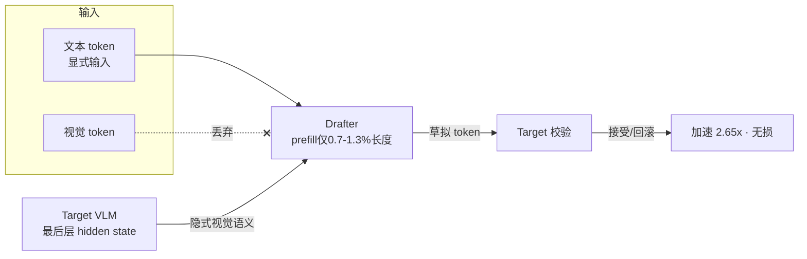
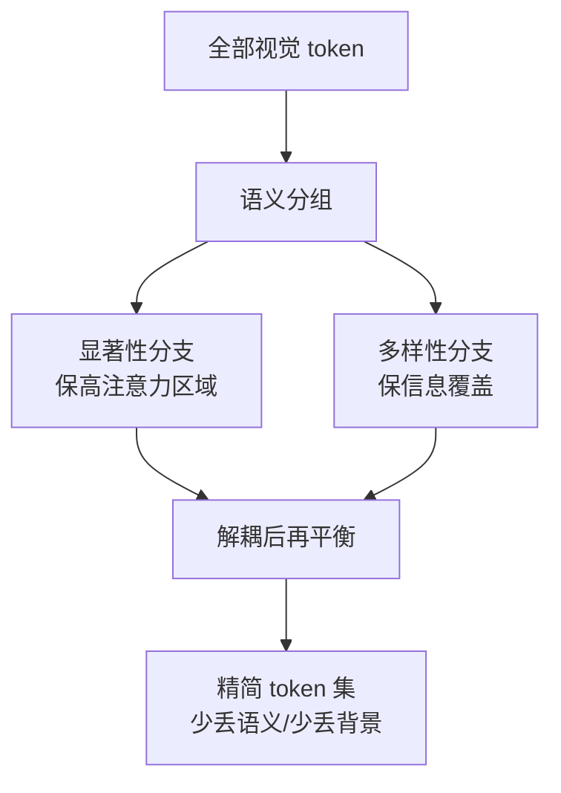
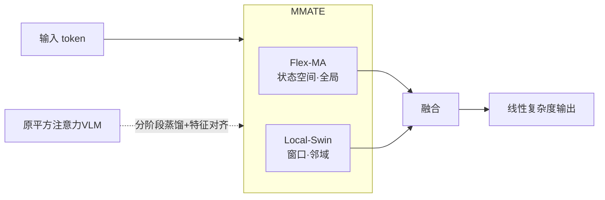
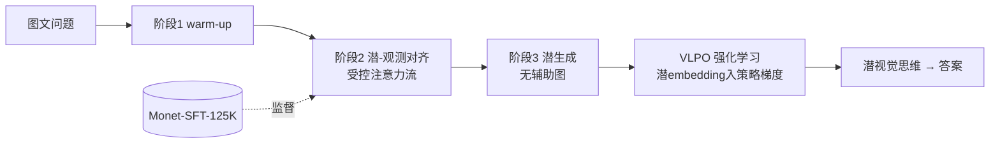
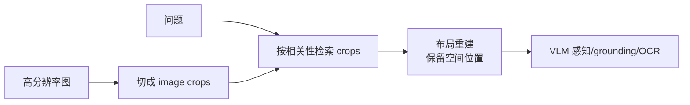

# CVPR 2026 · MLLM / VLM 详细清单

> ⚠️ **来源与插图说明**
> - arXiv/HF 在本环境被网络策略屏蔽（egress 403），**未能直读原文 PDF/正文**。下列介绍基于
>   **abstract + 项目页/二手聚合**交叉印证；方法细节与数字以原文为准。
> - 所有 mermaid 框图是 **我依据方法描述绘制的"示意图"，非论文原图**，仅帮助理解管线。
> - 出身标注：`✅` = 已确认；`待核` = 未能核实作者单位（不脑补）。
> - 会议标注：`[CVPR'26]` 已确认；`[待核]` 会议归属未确认。

---

## 🧩 一、效率 / Token 压缩（最贴"小而美 + 工程化"）

### 1. HiViS — 对 drafter 隐藏视觉 token，给 VLM 投机解码提速 `[CVPR'26]`
- **问题**：投机解码（speculative decoding）能加速 LLM，但搬到 VLM 上很别扭——大量视觉 token 拖慢
  drafter 的 self-attention；且 drafter 与 target VLM 常不同源，视觉 token 语义不对齐，污染 prefill 的 KV-cache。
- **方法**：把视觉 token **全部从 drafter 输入里拿掉**，只留文本 token 作为"显式输入"；同时直接复用
  target VLM 最后一层对应的 hidden state，把视觉语义作为"隐式输入"补回去（显式-隐式输入分解）。
- **结果**：drafter 的 prefill 序列长度压到 target 的 **0.7%–1.3%**，**无损**生成质量，最高 **2.65× 加速**。
- **为什么贴你**：典型小而美——一个分解 trick 就把 VLM 投机解码的痛点解掉，工程可直接用。
- **链接**：https://arxiv.org/abs/2509.23928 · 出身待核

### 2. PrismPrune — 解耦"显著性 vs 多样性"做视觉 token 剪枝 `[CVPR'26]`
- **问题**：现有视觉 token 剪枝有个内在 trade-off——**注意力引导**法保住高注意力区域却丢了背景多样性；
  **去重感知**法提升多样性却可能砍掉语义重要区域。两者被当成对立目标。
- **方法**：用**语义分组引导**的方式，把"语义重要性"和"信息多样性"**解耦**后再平衡，兼顾两者。
- **为什么贴你**：把一个被忽视的 trade-off 讲清楚并给出干净解法，idea 漂亮、改动小。
- **链接**：CVF 全文（题名可搜）· 出身待核
- *(注：另有近似主题工作 "Prune Redundancy, Preserve Essence" arXiv 2603.09480，可对照看)*

### 3. LinMU — 把多模态理解做成线性复杂度 `[arXiv / TMLR 在投]`
- **问题**：VLM 的 self-attention 是平方复杂度，高分辨率图、长视频、端侧部署都吃不消。
- **方法**：用 **M-MATE 双分支模块**替换每个 self-attention 层——**Flex-MA 分支**（双向状态空间模型，
  抓全局上下文）+ **Local-Swin 分支**（Swin 式窗口注意力，抓邻域相关）；配**分阶段蒸馏 + 隐特征对齐损失**，
  从平方注意力平滑迁移到线性模块。
- **结果**：在 MMMU / LongVideoBench / Video-MME 上保持竞争力，TTFT 与吞吐显著更快，验证线性可扩展。
- **为什么贴你**：纯工程提效、端侧友好；但**它是 TMLR 在投，不是 CVPR**（已纠正）。
- **链接**：https://arxiv.org/abs/2601.01322 · [OpenReview](https://openreview.net/forum?id=6BYdTSNrab) · 出身待核

### 其余效率向（表格速览）
| 论文 | 一句话 | 会议 | 链接 |
|---|---|---|---|
| **Myopia Rectification** | MLLM 的 KV-cache 剪枝：动态注意力补贴 + token 回收 | `[CVPR'26]` | CVF 待查 |
| **Nüwa** | 修补 token 剪枝破坏的**空间完整性** | `[待核]` | https://arxiv.org/abs/2602.02951 |
| **Energy-Driven Pruning** | 能量驱动的自适应视觉 token 剪枝 | `[待核]` | https://arxiv.org/abs/2603.05950 |

---

## 🔍 二、幻觉缓解（多为训练-free）

### 4. One Token, Two Fates — 操纵视觉 token 对抗 MLLM 幻觉 `[待核]`
- **问题**：MLLM 常对图里不存在的物体"言之凿凿"（object hallucination）。
- **方法**：统一框架，对视觉 token 做**协同视觉校准 + 因果表示校准**——同一 token 在不同处理下"两种命运"，
  借此抑制幻觉。
- **为什么贴你**：训练-free、即插即用思路。
- **链接**：https://arxiv.org/abs/2603.10360 · 出身待核

| 同主题备选 | 一句话 | 链接 |
|---|---|---|
| **Revealing & Enhancing Core Visual Regions** | 用内部注意力动态定位核心视觉区域抑制幻觉 | https://arxiv.org/abs/2602.15556 |
| **CRoPS** | 训练-free 幻觉缓解框架 | 题名可搜 |
| **DA-DPO** | 难度感知低成本 DPO 降幻觉 | 题名可搜 |

---

## 🧠 三、多模态推理（latent visual reasoning）

### 5. Monet — 在潜视觉空间里推理 `[CVPR'26]`
- **问题**："thinking with images" 靠外部工具往画里塞证据，做不到人类那种**抽象视觉想象**。
- **方法**：让 MLLM 直接在**潜视觉空间**生成连续 embedding 作为"中间视觉思维"。两大难点（潜-视觉对齐算力贵、
  对潜 embedding 监督不足）用**三阶段蒸馏 SFT**（warm-up → 受控注意力流的潜-观测对齐 → 无辅助图的潜生成）解决；
  并指出 GRPO 主要强化文本推理而非潜推理，提出 **VLPO（Visual-latent Policy Optimization）**把潜 embedding
  显式纳入策略梯度。配套数据集 **Monet-SFT-125K**（真实/图表/OCR/几何 CoT）。
- **结果**：**Monet-7B** 在感知与推理基准上一致提升。
- **为什么贴你**：方向新颖、方法成体系（SFT+RL+数据），CVPR 已确认；偏研究但有完整工程落地。
- **链接**：https://arxiv.org/abs/2511.21395 · [GitHub](https://github.com/NOVAglow646/Monet) · 出身待核

| 同主题备选 | 一句话 | 链接 |
|---|---|---|
| **Reasoning in the Dark** | 潜空间里图文交错推理 | https://arxiv.org/abs/2510.12603 |

---

## 📚 四、多模态 RAG / 知识接地（接你在看的 ADSeeker 主线）⭐

### 6. M4-RAG — 超大规模多语言·多文化·多模态 RAG 基准 `[CVPR'26]`
- **问题**：多模态 RAG 评测缺乏覆盖多语言/多文化的大规模基准。
- **方法/产出**：构建 **M4-RAG** 基准，跨 **42 种语言 / 56 种地区方言与语域**，**8 万+ 文化多样的图-问对**，
  评测跨语言、跨模态的检索增强 VQA。
- **为什么贴你**：和你看的 ADSeeker（知识注入 VLM）是同一主线的"评测侧"，有 GitHub、可复现。
- **链接**：[GitHub](https://github.com/davidanugraha/M4-RAG) · [CVF](https://openaccess.thecvf.com/content/CVPR2026/html/Anugraha_M4-RAG_A_Massive-Scale_Multilingual_Multi-Cultural_Multimodal_RAG_CVPR_2026_paper.html) · 出身待核

### 7. RAP（Retrieval-Augmented Perception）— 高分辨率感知遇上 visual RAG `[待核]`
- **问题**：真实世界图分辨率高，VLM 看不清细节（grounding、OCR 等吃亏）。
- **方法**：把高分图切成 **image crops 做检索**，再**布局重建**保住空间信息，按需把相关切片喂回模型。
- **为什么贴你**：训练-free、即插即用，工程味浓。
- **链接**：https://arxiv.org/abs/2503.01222 · 出身待核

| 同主题备选 | 一句话 | 链接 |
|---|---|---|
| **WikiSeeker** | 重审 VLM 在知识型 VQA 里的角色 | https://arxiv.org/abs/2604.05818 |

---

## 🤖 五、Agent × VLM（上批精选，并入此清单）

| 论文 | 一句话 | 会议/出身 | 链接 |
|---|---|---|---|
| **SenseSearch** | RL 教 VLM 多轮调用搜索/裁剪工具；<7B 开源 agentic SOTA，比 GPT-4o-mini +11.78 | `[CVPR'26]`·疑似商汤 | [CVF PDF](https://openaccess.thecvf.com/content/CVPR2026/papers/Chng_SenseSearch_Empowering_Vision-Language_Models_with_High-Resolution_Agentic_Search-Reasoning_via_Reinforcement_CVPR_2026_paper.pdf) |
| **Ego2Web** | 第一人称视频→web 任务 agent 基准 + Ego2WebJudge(~84%一致) | `[CVPR'26]`·UNC+疑似Google | [arXiv](https://arxiv.org/abs/2603.22529) · [GitHub](https://github.com/Yui010206/Ego2Web) |
| **LLMind** | 训练-free 视觉表征，1%/3%/5% 像素保 82%/92%/97% | `[待核]` | https://arxiv.org/abs/2603.14882 |

---

## 🆕 六、CVF 补捞（domain-locked 检索新增，2026-06-30）

> CVF 整页 `openaccess.thecvf.com/CVPR2026?day=all` 被 egress 屏蔽，无法整页通读；
> 以下用 `allowed_domains=openaccess.thecvf.com` 检索挖出，**带 CVF PDF 链接的即已确认 CVPR'26**。

### 已确认 CVPR'26（CVF 链接可查）
| 论文 | 一句话 | 方向 | 链接 |
|---|---|---|---|
| **LongVT** | 用**原生工具调用**激励"用长视频思考"，把每步推理接地到真实所见，缓解幻觉、提升时序定位 | 视频推理/agent | [CVF](https://openaccess.thecvf.com/content/CVPR2026/papers/Yang_LongVT_Incentivizing_Thinking_with_Long_Videos_via_Native_Tool_Calling_CVPR_2026_paper.pdf) |
| **EvoGraph-R1** | **自演化多模态知识超图**做 agentic 检索，给 MLLM 接外部知识（避免 OCR 误差但控冗余） | 多模态RAG/agent | [CVF](https://openaccess.thecvf.com/content/CVPR2026/html/Lin_EvoGraph-R1_Self-Evolving_Multimodal_Knowledge_Hypergraphs_for_Agentic_Retrieval_CVPR_2026_paper.html) |
| **M3DocDep** | 多模态·多页·多文档**依赖分块**（SharedDet=DP+OCR → LVLM 块嵌入 → 全局依赖解析），语料级 RAG **+4.5~15.3%** | 文档RAG | [CVF](https://openaccess.thecvf.com/content/CVPR2026/papers/Shin_M3DocDep_Multi-modal_Multi-page_Multi-document_Dependency_Chunking_with_Large_Vision-Language_Models_CVPR_2026_paper.pdf) |
| **OpenMMReasoner** | 开放通用的**多模态推理**训练配方 | 多模态推理 | 题名可搜（CVF） |
| **VLM-3R** ✅ | VLM + 指令对齐 3D 重建 + 时序推理新基准（VITA-Group+Meta） | VLM扩能 | [CVF](https://openaccess.thecvf.com/content/CVPR2026/html/Fan_VLM-3R_Vision-Language_Models_Augmented_with_Instruction-Aligned_3D_Reconstruction_CVPR_2026_paper.html) |

### 候选（arXiv 有，会议归属 `[待核]`）
| 论文 | 一句话 | 方向 | 链接 |
|---|---|---|---|
| **VisionTrim** | 训练-free 统一视觉 token 压缩，加速 MLLM | 效率 | https://arxiv.org/abs/2601.22674 |
| **EM-KD** | 蒸馏高效 MLLM，处理"不均衡视觉 token" | 效率/蒸馏 | https://arxiv.org/abs/2511.21106 |
| **ViCA** | **Vision-Only Cross-Attention** 做高效 MLLM | 效率 | https://arxiv.org/abs/2602.07574 |
| **TOPS** | 第一性原理构造"token 最优保留集"剪枝 | 效率 | https://arxiv.org/abs/2606.27161 |
| **Doc-V\*** | 多页文档 VQA 的**粗到细交互式**视觉推理 | 文档VQA | https://arxiv.org/abs/2604.13731 |
| **More Thought, Less Accuracy?** | 揭示 VLM 推理的"双刃"本质（想太多反而降准） | 推理分析 | https://arxiv.org/abs/2509.25848 |
| **When Thinking Drifts** | 证据接地做鲁棒视频推理，防"想跑偏" | 视频推理 | https://arxiv.org/abs/2510.06077 |
| **Mind the Heads** | 拓扑表示对齐改进 MLLM | 对齐 | https://arxiv.org/abs/2606.23885 |
| **Chain-of-Ground** | 迭代推理+参照反馈改进 GUI grounding | agent | https://arxiv.org/abs/2512.01979 |
| **Anticipatory Planning** | 多模态 AI agent 的前瞻式规划 | agent | https://arxiv.org/abs/2603.16777 |

---

## 我的优先级建议（按你口味）
1. **HiViS** — 工程提效天花板（2.65x·无损），小而美。
2. **PrismPrune** — trade-off 讲得漂亮，剪枝方向必读。
3. **M4-RAG** — 接你 ADSeeker 的 RAG 主线，有数据有代码。
4. （研究向加分）**Monet** — 潜视觉推理，方法成体系。

> 出身大多"待核"：深读时我会从 CVF/GitHub/作者主页坐实，达不到你"名校大厂"标准的会明确标出。
